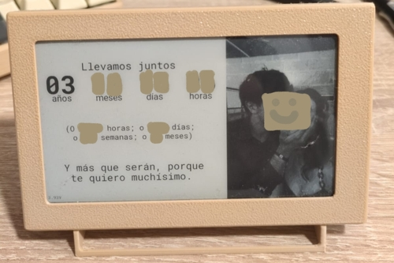

<p align="center">
  
</p>

# Anniversary counter display

A gift I made for my girlfriend's birthday. It is an e-ink screen controlled by an ESP32 that displays how much time we have been together, as well as a cute random phrase and a photo of the two of us.

It counts time in five ways:

- Years, months, days and hours since we started dating.
- Total hours.
- Total days.
- Total weeks.
- Total months.

This way we can know, for example, how much time we have been together (i.e. 2 years, 4 months, 17 days and 6 hours), whether this is our 1000th day together, or our 50th month.

Since I am obsessed with the ESP32, I promised Emma I would gift her one for her birthday, and she thought I was joking. Well, *I wasn't*.

## Building (software)

1. Run `prepare.sh` so the LilyGO submodule is downloaded and set up.
2. Copy `src/config.hpp.example` to `src/config.hpp` and change the configuration as you like.
   - Do not forget to convert some custom fonts and images using the LilyGO library. See the [converting images and fonts](#converting-images-and-fonts) section.
3. Run `sudo pio run` to compile, or `sudo pio run -t upload` to send it to the device.

## Building (hardware)

The hardware used to develop this is a LilyGO 4.7" e-paper ESP32. I put a 2500mAh battery on it.
The STL files for the case are on the releases page.

## Converting images and fonts

**Images** must be 350x540px (width set in `src/config.hpp`). Once the image has that resolution, use `imageconvert.py` like this to generate the header file (keep in mind that `IMG_NAME` is the name of both the header file and `struct` that contains the image, and `IMG_PATH` is the source image):

```sh
IMG_NAME=
IMG_PATH=
python3 ./LilyGo-EPD47/scripts/imgconvert.py \
  -n $IMG_NAME -i $IMG_PATH -o img/$IMG_NAME.h
```

After this, you must edit `src/config.hpp` and include the header file generated before (`#include ../img/IMG_NAME.h`) and add the struct to the list (just like the examples).

As for **fonts**, you can use the following script:

```sh
FONT_NAME=
FONT_SIZE=
FONT_PATH=
python3 ./LilyGo-EPD47/scripts/fontconvert.py --compress \
  $FONT_NAME $FONT_SIZE $FONT_PATH \
  > font/$FONT_NAME-$FONT_SIZE.h
```
Where `FONT_NAME` and `FONT_PATH` are equivalent to the environment variables for images (name of header file and `struct`, and path to the source `ttf` file respectively), and `FONT_SIZE`, the function of which is impossible to guess by name alone :)

### In NixOS

This is the required `nix-shell` for all of this to work (at least the python part):
```sh
nix-shell \
  -p python312 \
  -p python312Packages.freetype-py \
  -p python312Packages.pillow
```

I want to make a flake, but PlatformIO does not work well with them.
